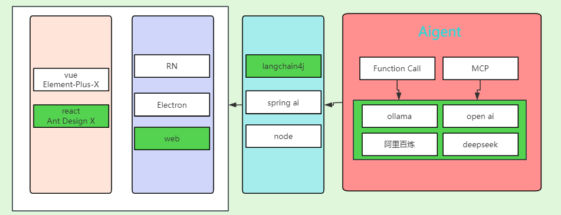

| DeepSeek       | 阿里百炼平台   | OpenAI        |
|----------------|----------------|---------------|
|  |  |  |

| Ollama         | LangChain4j    | Pinecone      |
|----------------|----------------|---------------|
|  |  |  |

| Spring Boot    | MySQL          | MongoDB       |
|----------------|----------------|---------------|
|  |  |  |

| MyBatis Plus   | Maven          | React         |
|----------------|----------------|---------------|
|  |  |  |

| Node.js        |                |               |
|----------------|----------------|---------------|
|  |                |               |


# antx

##  Getting Started with Create React App

This project was bootstrapped with [Create React App](https://github.com/facebook/create-react-app).

## Available Scripts

In the project directory, you can run:

### `npm start`

Runs the app in the development mode.\
Open [http://localhost:3000](http://localhost:3000) to view it in your browser.

The page will reload when you make changes.\
You may also see any lint errors in the console.

### `npm test`

Launches the test runner in the interactive watch mode.\
See the section about [running tests](https://facebook.github.io/create-react-app/docs/running-tests) for more information.

### `npm run build`

Builds the app for production to the `build` folder.\
It correctly bundles React in production mode and optimizes the build for the best performance.

The build is minified and the filenames include the hashes.\
Your app is ready to be deployed!

See the section about [deployment](https://facebook.github.io/create-react-app/docs/deployment) for more information.

### `npm run eject`

**Note: this is a one-way operation. Once you `eject`, you can't go back!**

If you aren't satisfied with the build tool and configuration choices, you can `eject` at any time. This command will remove the single build dependency from your project.

Instead, it will copy all the configuration files and the transitive dependencies (webpack, Babel, ESLint, etc) right into your project so you have full control over them. All of the commands except `eject` will still work, but they will point to the copied scripts so you can tweak them. At this point you're on your own.

You don't have to ever use `eject`. The curated feature set is suitable for small and middle deployments, and you shouldn't feel obligated to use this feature. However we understand that this tool wouldn't be useful if you couldn't customize it when you are ready for it.

## Learn More

You can learn more in the [Create React App documentation](https://facebook.github.io/create-react-app/docs/getting-started).

To learn React, check out the [React documentation](https://reactjs.org/).

### Code Splitting

This section has moved here: [https://facebook.github.io/create-react-app/docs/code-splitting](https://facebook.github.io/create-react-app/docs/code-splitting)

### Analyzing the Bundle Size

This section has moved here: [https://facebook.github.io/create-react-app/docs/analyzing-the-bundle-size](https://facebook.github.io/create-react-app/docs/analyzing-the-bundle-size)

### Making a Progressive Web App

This section has moved here: [https://facebook.github.io/create-react-app/docs/making-a-progressive-web-app](https://facebook.github.io/create-react-app/docs/making-a-progressive-web-app)

### Advanced Configuration

This section has moved here: [https://facebook.github.io/create-react-app/docs/advanced-configuration](https://facebook.github.io/create-react-app/docs/advanced-configuration)

### Deployment

This section has moved here: [https://facebook.github.io/create-react-app/docs/deployment](https://facebook.github.io/create-react-app/docs/deployment)

### `npm run build` fails to minify

This section has moved here: [https://facebook.github.io/create-react-app/docs/troubleshooting#npm-run-build-fails-to-minify](https://facebook.github.io/create-react-app/docs/troubleshooting#npm-run-build-fails-to-minify)




 <!--  -->

##  🎉 antx 环 境  

node v20.17.0

ollama 3.1

[https://ollama.com/download](https://ollama.com/download)

- 使用

https://www.npmjs.com/package/ollama
https://juejin.cn/post/7381478389468872741

## 🎉 codespaces 使用

https://docs.github.com/zh/enterprise-cloud@latest/codespaces  
https://juejin.cn/post/7102620860720087053  

## 🎉 构建镜像 

docker-compose up --build 

ollama 需要执行 
ollama run llama3.2 

```
@gonggbb ➜ /workspaces/antx-ollama (main) $ docker exec -it 77c /bin/bash
root@77c497b4fb17:/app# curl http://ollama:11434/v1/models
{"object":"list","data":[{"id":"llama3.2:latest","object":"model","created":1735625441,"owned_by":"library"}]}
root@77c497b4fb17:/app#

```
## ollama 3.1 太大, codespaces资源有限切换3.2

https://redesigned-adventure-6746p57pwxc4467-3000.app.github.dev/ 


##  存在的问题 

- 同一个容器里面可以访问但是： 通的
```
ollama
curl http://ollama:11434/api/chat

curl http://localhost:11434/api/chat -d '{
  "model": "llama3.2",
  "messages": [
    { "role": "user", "content": "why is the sky blue?" }
  ]
}'
```
 
### 组件 Independent.js 拆分的  
 切换 messagesMap 清空无效

### dokcer antx-o
 (blocked:mixed-content)


# 🎉  langchain4j 

# Getting Started

### Reference Documentation
For further reference, please consider the following sections:

* [Official Apache Maven documentation](https://maven.apache.org/guides/index.html)
* [Spring Boot Maven Plugin Reference Guide](https://docs.spring.io/spring-boot/3.4.5/maven-plugin)
* [Create an OCI image](https://docs.spring.io/spring-boot/3.4.5/maven-plugin/build-image.html)
* [Spring Web](https://docs.spring.io/spring-boot/3.4.5/reference/web/servlet.html)

### Guides
The following guides illustrate how to use some features concretely:

* [Building a RESTful Web Service](https://spring.io/guides/gs/rest-service/)
* [Serving Web Content with Spring MVC](https://spring.io/guides/gs/serving-web-content/)
* [Building REST services with Spring](https://spring.io/guides/tutorials/rest/)

### Maven Parent overrides

Due to Maven's design, elements are inherited from the parent POM to the project POM.
While most of the inheritance is fine, it also inherits unwanted elements like `<license>` and `<developers>` from the parent.
To prevent this, the project POM contains empty overrides for these elements.
If you manually switch to a different parent and actually want the inheritance, you need to remove those overrides.


## langchain4j

LangChain4j 提供与许多LLM 提供商、 嵌入/矢量存储等的集成。每个集成都有自己的 maven 依赖项。
https://docs.langchain4j.dev/get-started

https://github.com/langchain4j/langchain4j/tree/main


## springboot 

LangChain4j Spring Boot 集成需要 Java 17 和 Spring Boot 3.2。

https://docs.langchain4j.dev/tutorials/spring-boot-integration

## 模型排行

https://superclueai.com/


## 模型 
https://docs.langchain4j.dev/integrations/language-models/


## deepseek api

## DEEP_SEEK_API_KEY 环境变量

https://www.deepseek.com/

https://api-docs.deepseek.com/zh-cn/

## ollama

https://ollama.com/

https://github.com/ollama/ollama


```
| Llama 3.3          | 70B        | 43GB  | `ollama run llama3.3`            |
| Llama 3.2          | 3B         | 2.0GB | `ollama run llama3.2`            |

ollama run Llama3.2 
```

https://ollama.com/search


## 使用

https://docs.langchain4j.dev/integrations/language-models/ollama#get-started


## mongodb

服务器： mongodb-windows-x86_64-8.0.6-signed.msi https://www.mongodb.com/try/download/co
mmunity
命令行客户端 ： mongosh-2.5.0-win32-x64.zip https://www.mongodb.com/try/download/shell
图形客户端： mongodb-compass-1.39.3-win32-x64.exe https://www.mongodb.com/try/download/c
ompass


## 阿里百炼平台

模型列表：
https://help.aliyun.com/zh/model-studio/models

模型广场：
https://bailian.console.aliyun.com/?productCode=p_efm#/model-market

API Key：
https://bailian.console.aliyun.com/?apiKey=1&productCode=p_efm#/api-key

LangChain4j参考文档： https://docs.langchain4j.dev/integrations/language-models/dashscope#plain-java


### token使用

https://api-docs.deepseek.com/zh-cn/quick_start/token_usage

https://bailian.console.aliyun.com/?tab=model#/efm/model_experience_center/text


### 文本向量

https://help.aliyun.com/zh/model-studio/text-embedding-synchronous-api?spm=a2c4g.11186623.help-menu-2400256.d_2_5_0.592672a3yMJDRq&scm=20140722.H_2712515._.OR_help-T_cn~zh-V_1

## 存储 pinecone

https://www.pinecone.io/

## doc
http://localhost:8080/doc.html

http://localhost:8080/doc.html#/-v3-api-docs/%E7%A1%85%E8%B0%B7%E5%B0%8F%E6%99%BA/chat
 

